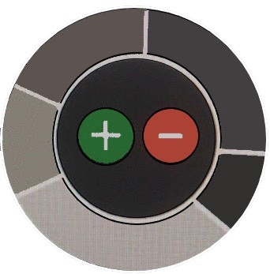
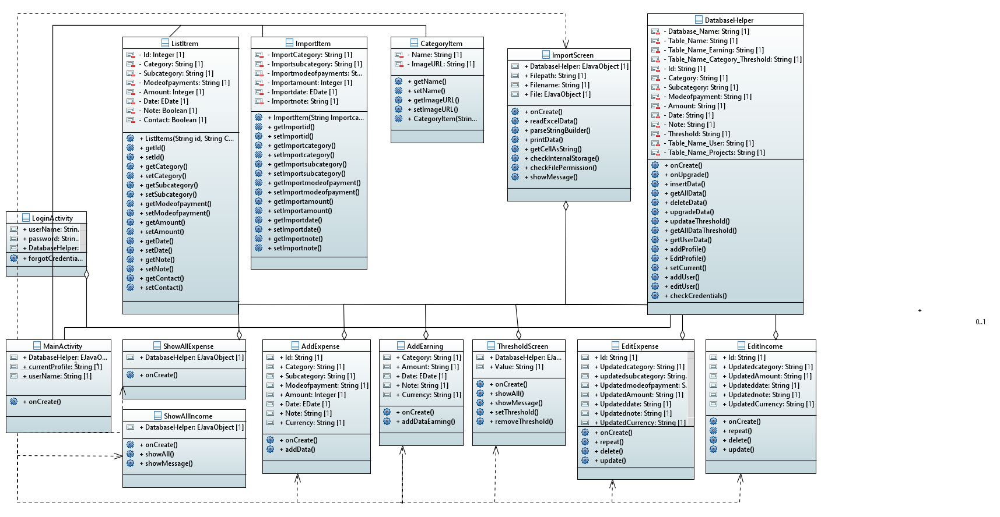
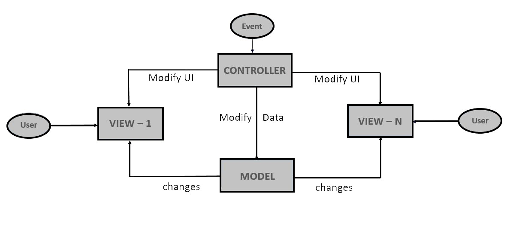
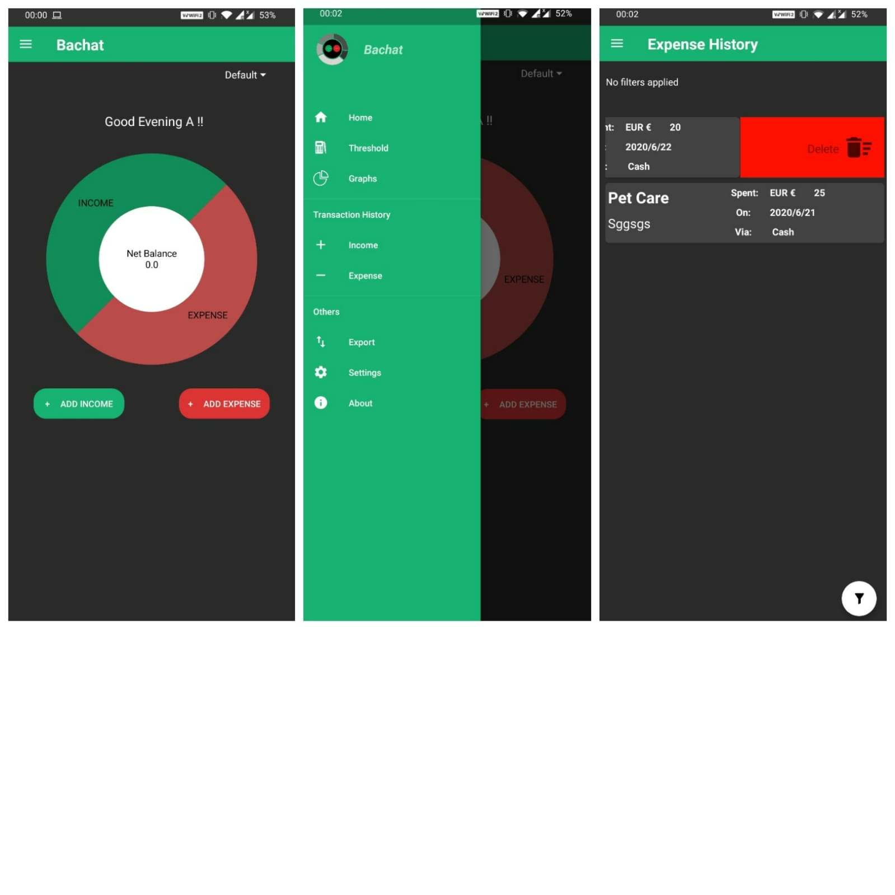
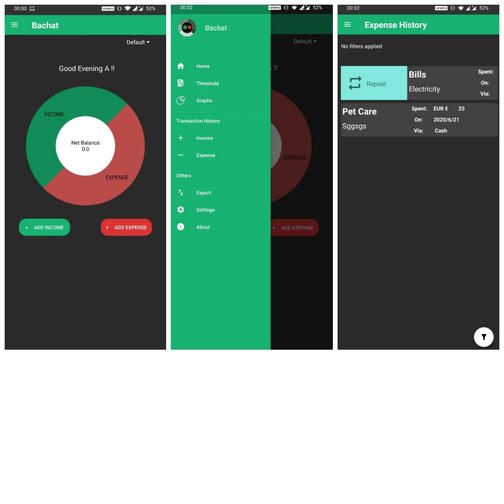

##### Hello all and welcome back to Team Gingerbread's journey of creating an efficient budget control Android application to help make money management as easy as a *ROLL* in the park. 

##### Well, I would've mentioned *WALK* but then, as you are happy that **Bachat** is there to take care of your financial worries, you might as well roll around while in the park. Like our logo wants to.

###### Anyway, hope you had a good time using our Basic Prototype from the last blog. I hope you didn't find as many bugs as our client did. The first meeting that we had with our client after the submission of our basic prototype was so long due to two main reasons:

* There were so many feedbacks (bugs actually but we like to keep things sugar-coated) from our client and the fact that we missed a lot of details proved that our client is a very intelligent person with top class application-breaking skills and also taught us that aggressive testing is very important 

* Our client showed us why he is one by surprising us with more requirements(with the *client's* smile). 

At the end of the call, we realised how it feels to get the kick of a typical *Agile* scenario.

## Changes to user stories:
 The new requirements took us by surprise mainly because they were more than we ever expected. Infact, there were so many new requirements that it could be made into three new sets of listed items like given below:  

**Essential requirements:**

*  	I would like to be able to add transactions in multiple currencies.  
*	I would like the transactions which I have added in a foreign currency to get converted to my default currency automatically according to live values. 

Being essential, we have completed both of these requirements.

**Necessary requirements:**

*  	I would like to have some kind of a login screen, to prevent un-authorised access to my transactions by others who might use my device.
*  	I would like to have a start screen at the first install of the app which can explain what the app is about and how to use the general features.
*  	I would like to attach contacts to my transactions, and get detail of their name, numbers (all) and e-mail ids (all) from my contact list.

We consider necessary equally important as essential and therefore, we have completed these requirements as well. 

**Nice to have requirements:**

*  	I would like to create several projects within the same app, so that I can manage my transactions from different domains (say official and domestic) easily.
*  	It would be nice to have the app guide me in some form by providing a few recommendations, based on my activities to increase ease of use and manage my budget smartly.
*  	I would like to receive notifications, informing me about aspects related to my budget activities.

We have implemented the requirement of the several projects or profiles within the same app.

**Updated class diagram represents the changes:**

Most of the added functionalities are managed within the existing controllers. The main difference we have is that of the addition of the Login Activity class.

## Design Pattern

Like most softwares, we too have followed the popular Model View Controller(MVC) architectural design pattern for our software. 

Our software model has many views each of which come under direct access of the user as shown in the diagram. These views are modified by the controller based on an event of interaction of the User on the view. The event can also result in changes in the Model, which is where all the data storage is managed, also has the ability to change the views with the help of a helper class.

##### There are many reasons behind us choosing this design pattern. A few of them are: 

*  Changes can be made easily as modifications does not affect the entire model. This is very useful in an Agile scenario.
*  The MVC gives the software an ability to use multiple views. As we expected a lot of requirements from our client, and got the as well, this feature has helped us a lot in the journey.
*  MVC, most importantly, allows multiple users to work parallel on the software helping in really fast development.

### Design principles

Mobile Apps are now a mainstream, trusted way to deliver content and services. But in a crowded market, how does a mobile app become useful, relevant, and valued so it delights and retains users? 
Apps provide opportunities to build around user needs and grow long-term and profitable relationships with loyal customers. It's become tougher for developers to get people to find and download their apps, and once they do, stay engaged.
According to Google, As many as 25% of app users open an app once and never return.
We know that following a simple, powerful set of principles helps. Mobile apps need to help users complete their tasks and make it easy to convert.

#### These are 5 basic Dieter Rams' principles which we are following here in order to develop an app which we believe will help it stand out from the rest.

##### 1.	Useful

##### 2.	Understandable

##### 3.	Honest

##### 4.	Aesthetic

##### 5.	Detailed

We have followed the principles all throughout our app. Here is a preview of how the app tries to make good on its promise

**Registration**

*  	Provide clear utility before asking users to register

A new app is a gateway to a new world, and the user is alien to all the possibilities hidden inside. While we agree there is a certain charm to mystery, we firmly believe that a new user should at least be made aware of the functionalities at his disposal of he chooses to explore further. Plus, we are not going to give up this one and only chance of making a first impression, are we now? 

Keeping the same in mind, the first time you interact with “Bachat” it interacts with you too. The app knows it can be difficult to break the ice. You get greeted with a brief introduction of what you can expect to do inside the app before we ask to tell us a little something about yourself.
  
**App Navigation and Exploration** 

* 	Show the value of your app upfront.
Now that you decided to make familiar, the app opens up the Main Activity, where we take come straight to the point, and display the earning and expense summary and also provide you the options to log an expense or earning. Everything you need, right there where you need it!
 
**Provide filter and sort options**
	
*  Now that you have entered transactions, wouldn’t it be great if you also see them for a category? Or may be for a specific period? Or perhaps even by the mode of payment? Or perhaps a combination to see where your money went! Hey, we do not judge if you spent huge sums of money in shopping the previous week. We have got you covered, with access to filters on a single click, you search for and filter data with a simple tap.

**Build user-friendly forms**

* 	Match the keyboard with the required text inputs
I would not want to see a QWERTY keyboard when I am being asked to fill the amount, would you? If your answer to that is “NO!”, then we are on the same page here. We have tried to take care of these small issues by making sure to the best of our ability that you get greeted to proper input keyboards at proper places. 

*  	Provide helpful information in context in forms
We will come out and say it, forms can be confusing. Believe us to look out for your ease of understanding, as we have provided proper labels and hints so that you will always be in the know.

*  	Communicate form errors in real time

Errors, it is only human that we make them. At least we hope it is not a bot which is using the app! If it is, then please stop. Making an error and not being told what or where the mistake was is never good. We know it can be frustrating to figure out what was it that went wrong. The app provides you proper toasts and images to explain when something is not right so you always know what to correct 
 Usability and Comprehension

*  	Speak the same language as your users.
Technical lingo is not what you want to see in your everyday life. We made sure the terms used inside the app are user friendly so that you will always find it convenient to interact with it.

*  	Provide visual keys to clarify visual information
See an icon and not understand what it is? That won’t be case when you use our app. We have ensured that there are proper icons and that they are accompanied by proper labels, to keep you in loop. Graphs, categories or currencies you name it; we have it all.

*  	Ask for permissions in-context
We believe in being honest and transparent with what we want to access and how we want to. Whenever the app wants to access some data, it will always ask you first and only then work if you permit.

**Commerce and Conversions**

*	Provide seamless conversions, and make accessible all the options
Currency conversion may be a hassle at the airport, inside our app it is not. Just put the currency and the amount in the form, and the app will convert the amount to your default currency on its own. It couldn’t be any easier.

## Implementation & UI:

### Coding Conventions

The coding convention we are using are the basic java coding conventions.
The idea is to implement a convention which is widely known and accepted in order to increase, readability, portability and brevity.

Also, an added advantage of following these conventions is that it helps in error checking and hence makes it more efficient to look for and correct them.

We have tried to the best of our ability to follow the basic rules, such as
 
**Naming conventions for the methods and the classes and the variables.** 

Following standard java name conventions, such as UPPER_CASE for constants and CamelCase for functions and lower_case for imports
The naming of the variables and methods is kept descriptive.

**Inline comments and indentation** 

The code is properly indented making it more readable and understand the flow
The code consists of proper comments to mention what each part of the code block is supposed to do and what libraries are being used

**Method Definitions**

Care has been taken to make sure that methods are simple and crisp, where ever methods needed extra functionality, we have followed a golden rule “to split the method if it is longer than 10 lines”

**Program structure** 
 
As suggested in java, we are following modular design structure, breaking into classes and using sub-classing and object calls to populate data structures with generics based on these class objects. 

### Context of Use

**An Office employee who has to travel a lot** 

If you fall under this category, **Bachat** would make your life so much better. 

*  The application allows you to add your expenses and earnings in different currencies while entering them. The entered amounts will be converted to a Default Currency, which again can be set by the user himself.

*  **Bachat** gives graphical analysis of the user's expenditure and this analysis is based on the converted amount. Therefore, the user can see all his expenses and earnings converted to the currency that he uses the most so that he can clearly see how the money has been flowing in and out of his pockets.

*  Another main feature that **Bachat** provides is the ability to choose different profiles and hence giving the user the chance to have one profile dedicated for business-related transactions and another for personal transactions.
 

**An International student who is trying to control his budget** 

*  Being International students ourselves, we know how hard it is to keep track of our expenses. This application gives the user a chance to set thresholds every month on different categories so that he can keep a check on his expenses.

*  **Bachat** also gives the chance to attach a contact to the transaction added so that the user can keep track of the money lending and borrowing activities that are common amongst students.

## Design Solution

We have changed our user - interface a bit in comparison with the Basic Prototype. We have tried bringing more colours into the application.

The screenshot of the user-story that you can see below is that of deleting a transaction. The user can go from the home page, to the list of transactions and swipe left to delete the transaction.

The image given below is that of the repeat functionality. The user can go from the home page, to the list of transactions and swipe right to repeat the transaction. Have a look at the screenshot below regarding this user story.

The main reason for choosing this design pattern is the feedback from our very own client and we see that feedback with the highest priority. Apart from this, we have chosen the design pattern such that it provides maximum convenience to user.Everything which is considered essential for the user has been kept central and all the options are highlighted and labelled properly with hints in order to assist the user always.

## Working Prototype:

A video of our Advanced Prototype can be seen here -> [Advanced Prototype video](https://code.ovgu.de/steup/gingerbread/-/blob/4713b3b9cdd26314f36f96472ead62e9f4f2d43d/media/20-06-22-00-47-25.mp4).

The video shows the journey of the user from logging in -> seeing the front page -> clicking on the button to add an expense -> choosing a category -> choosing a subcategory -> Entering an amount -> choosing a currency -> converting it to his default currency -> based on live rates -> clicking on Add Expense to add the expense -> coming back to the home screen where he sees the new expense reflect on the graph -> then going to settings and adding a profile -> coming back to the main page and changing the profile (at right top corner) and seeing a new graph as it is a different profile with different transactions -> then going to the export option and exporting his transaction -> then going to the transactions and seeing his transaction -> swiping right to repeat an existing transaction -> swiping right to delete a transaction.

You can find the advanced prototype apk here -> [Advanced Prototype apk](https://code.ovgu.de/steup/gingerbread/-/blob/6039725d358127db043ad09bb38c1b805eb38bd0/apk/Bachat.apk).