Welcome back to the journey of our team and now that we are done with the Introductions and the Motivations, let us move onto the more serious part **->** ***Application Development.***

This blog post will tell you the story of how we went about creating our app's ***Basic Prototype*** and given below is the list of events that spanned across our application's development process.

*  Deciding our app name and logo
*  Discussing the user requirements with our client and creating user stories for the same
*  Identifying and Rectifying our wrong assumptions about user requirements
*  Creating the Use-case diagram for the app
*  Management of app development work
*  Creating the class-diagrams as the development progressed
*  Finally, the completion of our basic prototype
> ***There are some screenshots too, so do check them out***

## Bachat!
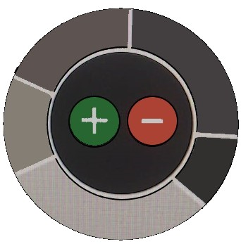

Yes! that is the name of our app. Our App logo is the one you can see on the right ->

Incase you do not know what it means, 
'**Bachat**' means savings in the language of Hindi.

We decided to name our app Bachat due to the following reasons:
1. All the team members of Gingerbread know Hindi, even though all of us 
   are not from the same country.
2. Our app is being designed to help you, the user, keep track of all expenses and set limits
   on the expenditure so that your savings stay checked and be available for your big dreams.
3. Bachat also sounds similar to Budget so it's all relative again. But consider this point 
   as a filler to make it 3 points as two is too small a number. 

About the logo, we will let you guess how we decided on it on your own as we move further. 
For now, wait till you see the screenshots of the basic prototype to get a hint perhaps.

> **You can trust on *Bachat* to take care of your Bachat. :)** 

# Requirement Analysis

The requirement analysis for the application was identified in two steps:

**Step 1:** Preliminary research was conducted by approaching the customer and classifying requirements and expectations into the following three categories based on priorities:

* I.   **Essential** : These are the features absolutely needed for the basic foundation of the application. 
 
* II.  **Necessary** : These features will be built upon the essential features so that all the crucial expectations are met. 
 
* III. **Nice to have** : These features are focused to enhance the application to bring it at par with real-time applications available on Store.

**Step 2:** Once the requirements were gathered, the team members were assigned to identify applications needed to achieve the customer's anticipations starting with the most essential ones.
Each team member took up the role of a customer in order to help identify anything that could to be added to the above categories. This was coupled with reference to existing budget management apps for ideas to make the life of the user easier.

The requirement analysis was marked complete for now and we gathered all the inputs to proceed to make User Stories. 

## User Stories

 The user stories given below are numbered according to the priorities set by the client. Within the tags of Essential, Necessary and Nice to have, those user stories that come at the top are those with the highest priority and vice versa. 

#### Essential:
1. **As a user, I would like to be able to enter my expenses and group them into categories.** 
2. **As a user, I would like to add a date and timestamp on every expense I enter.**
3. **As a user, I would like to select expenses based on filters like category, date, month and year.**  
4. **As a user, I would like to have a feature of adding notes, bullet points and other details for every expense I add.**
5. **As a user, I would like to have an option to choose the method of payment.**
6. **As a user, I would like to have a repeat expense option for me to repeat an expense from the list of expenditures.**

#### Necessary:
1. **As a user, I would like to have icons assigned to each category.**
2. **As a user, I would like to have an option of updating and/or deleting my transaction entries when required.**
3. **As a user, I would like to see the list of repeated transactions to choose from when I am entering a new transaction.**
4. **As a user, I would like to have a feature for overall budget planning and also be able to set category level thresholds.**
5. **As a user, I would like to have a dedicated tab to enter incomes from all different sources.**

#### Nice to have:
1. **As a user, I would like to see my expenses in the form of graphs or charts, to get a percentage overview.**
2. **As a user, I would like to have a help section that gives me overview of how to use the application.**
3. **As a user, I would like to have insights about my spending, including the categories in which I have spent the most on a weekly/monthly basis.**
4. **As a user, I would like the app to import/export my weekly/monthly/yearly details of entries.**
5. **As a user, I would like to select the currency when I enter the transactions and convert it to a default currency that I have set.**

Note that we had more features from the result of our 2-step Requirement Analysis which we decided to include as complimentary additions as we progress (of course upon the client's agreement).

### Wrong Assumption Identification and Rectification

>  **"No one is perfect"**

Yes, we proved this right by coming up with a couple of wrong assumptions from what the client asked us to do:

* **Recursive vs repeated payments**: While taking care of the repeated payments, we thought that our application should incur recurring expenses on behalf of the user. On further clarification with the client, we confirmed that the essential requirement is to only have a repeat option.

* **Online database**: When taking care of the database, we assumed that the user would be content with the idea of online data storage but many users may not be comfortable in sharing information online and indulging in an online activity will require the user to create a login ID and pass additional information. Therefore, the assumption was restructured. 

Once we got those requirements rectified we proceeded further. Let us now look at the Use Cases of the app.

### *Use Case Diagram*

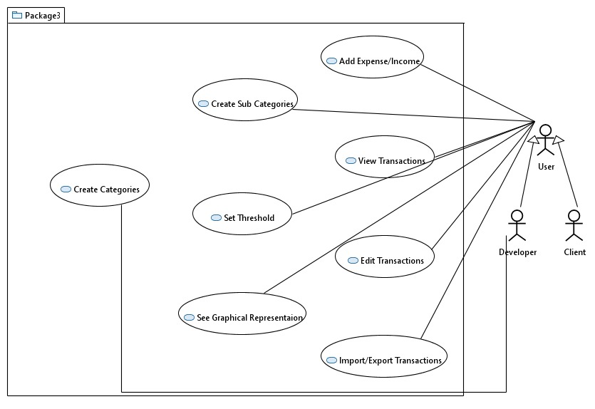

#### *Add Expense Use Case*

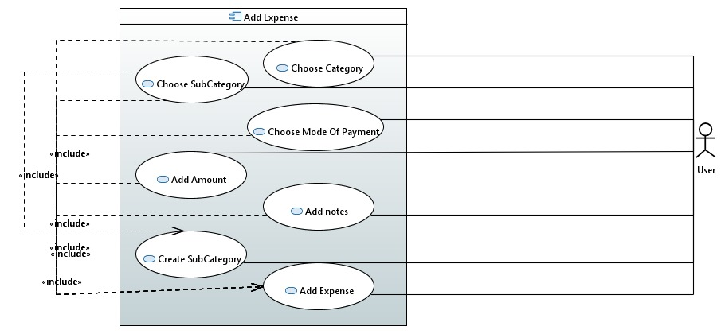

#### *Edit Transactions Use Case*

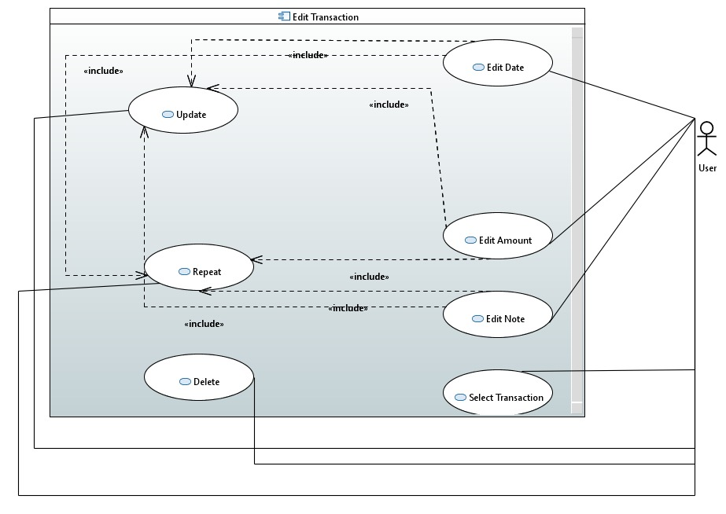

# System Design

#### *Class Diagram*

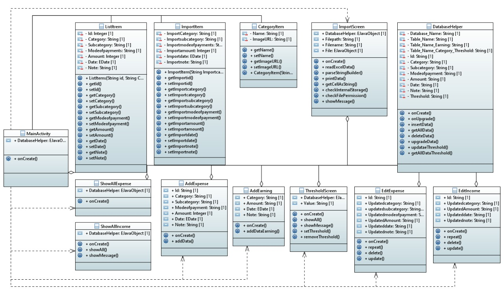

#### *Add Expense Activity*

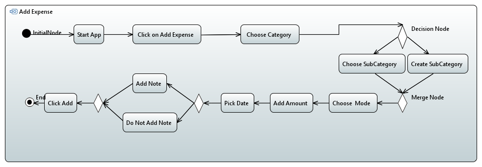

#### *Update Activity*

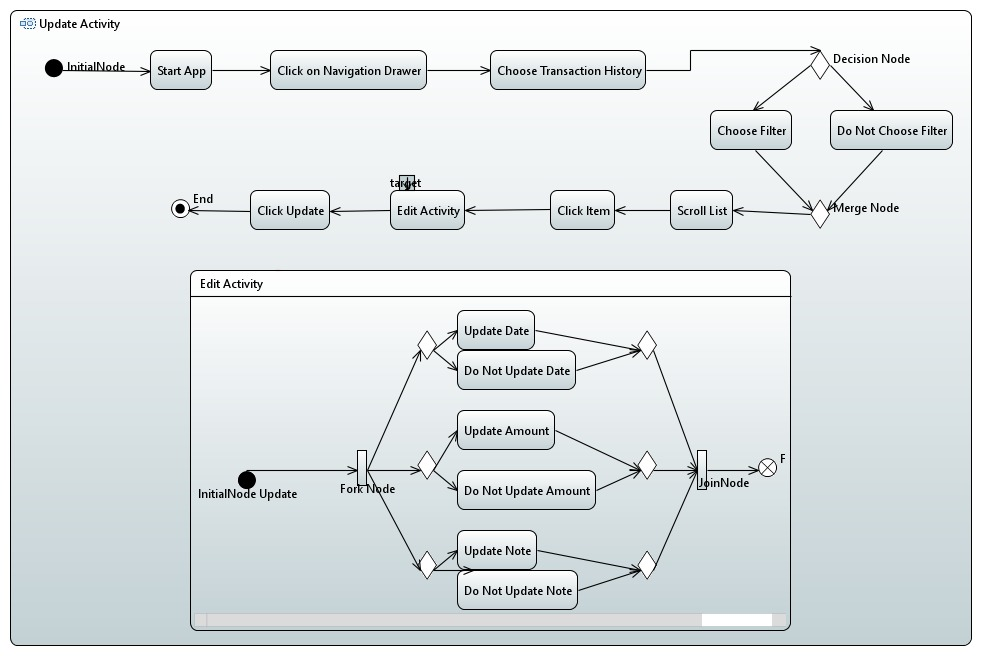

## Development Strategy

The team went about with the app development as follows:

*  The Product owner and the SCRUM master was decided for the team.
*  All discussions took place online through Skype and Zoom meetings. The SCRUM master took care of scheduling these.
*  Initially responsibilities and related developments for each member were decided and worked upon on a weekly basis.  
*  As the development progressed, issues were recognized and assigned with deadlines to the members in GitLab.
*  Two meetings were scheduled per week. One before the weekly call with the client to discuss and integrate the work done in the previous week, and one after the client meeting to discuss on the next set of developments and assign issues to the members.

### Dashboard for Issues

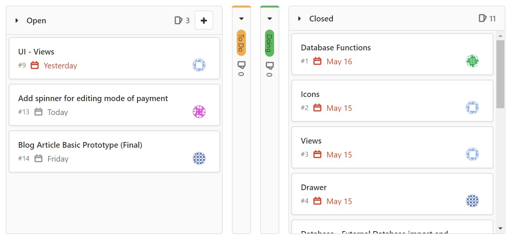

# Working Prototype

#### ***Home Activity*** 

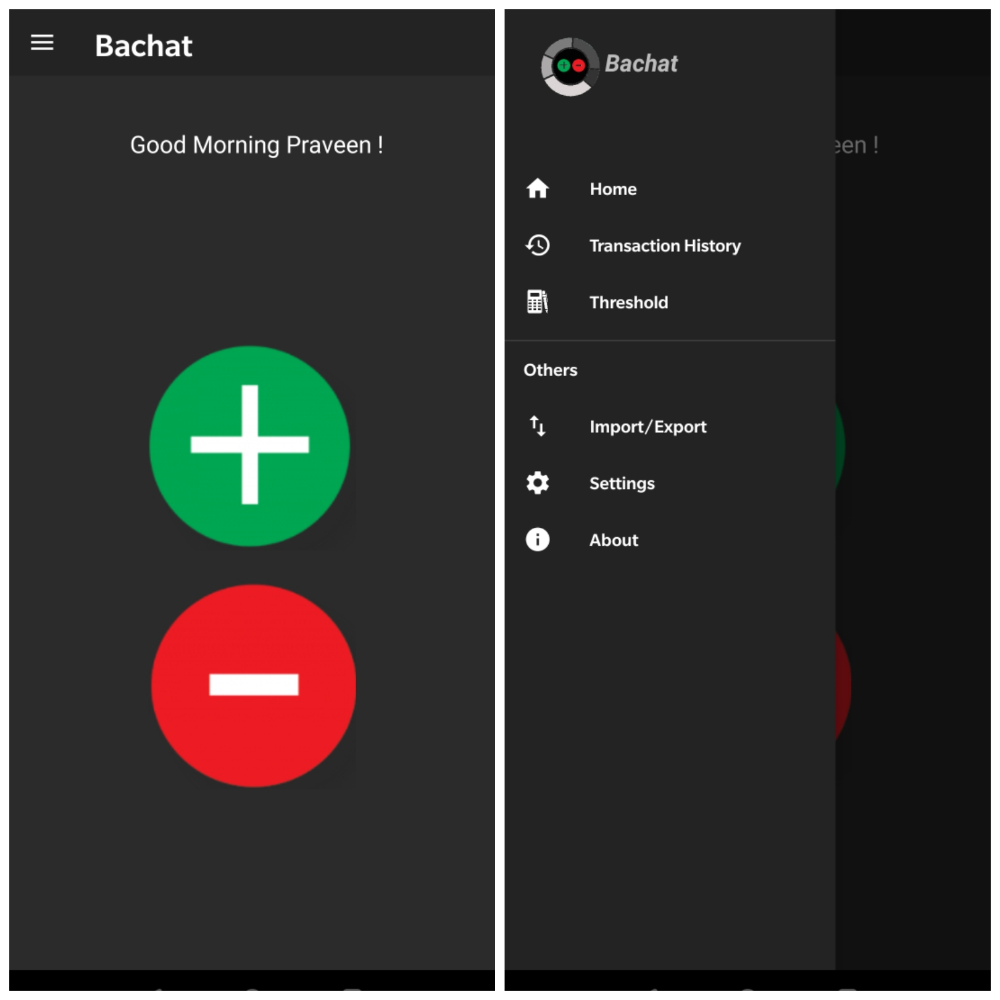

* **When the user opens the application they are hosted to this Home fragment which includes a “Minus” button for adding expenses, a “Plus” button for adding income and a navigation drawer to traverse between different fragments such as Transaction History, Threshold Setting and Import/Export.** 

#### ***Adding Expense/Income***

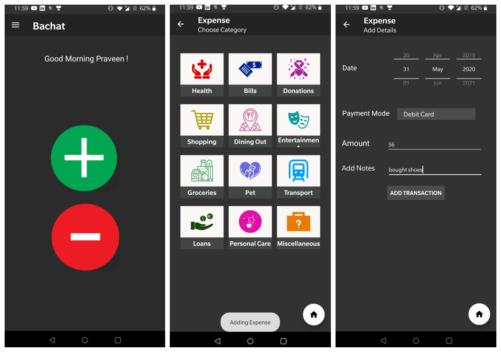

* **Once the user has clicked the minus or plus button, he can select different categories and then proceed to select pre-defined sub-categories related to the chosen category or add his own sub-category. Next, the user is given an option to choose the date, enter the amount along with the payment mode. The user is also given an option to add notes related to the transaction.**    

#### ***Transaction History***

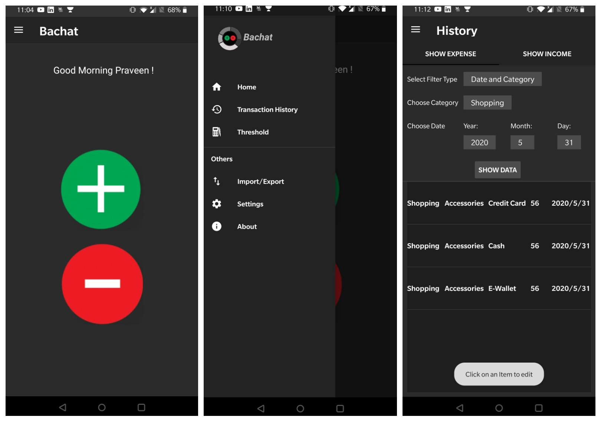

* **This fragment shows all data entered by the user. The user can tab between his income and expense transactions. The user is also given options to filter the transactions based on Category, Date, Category and Date.**  

#### ***Edit Screen***

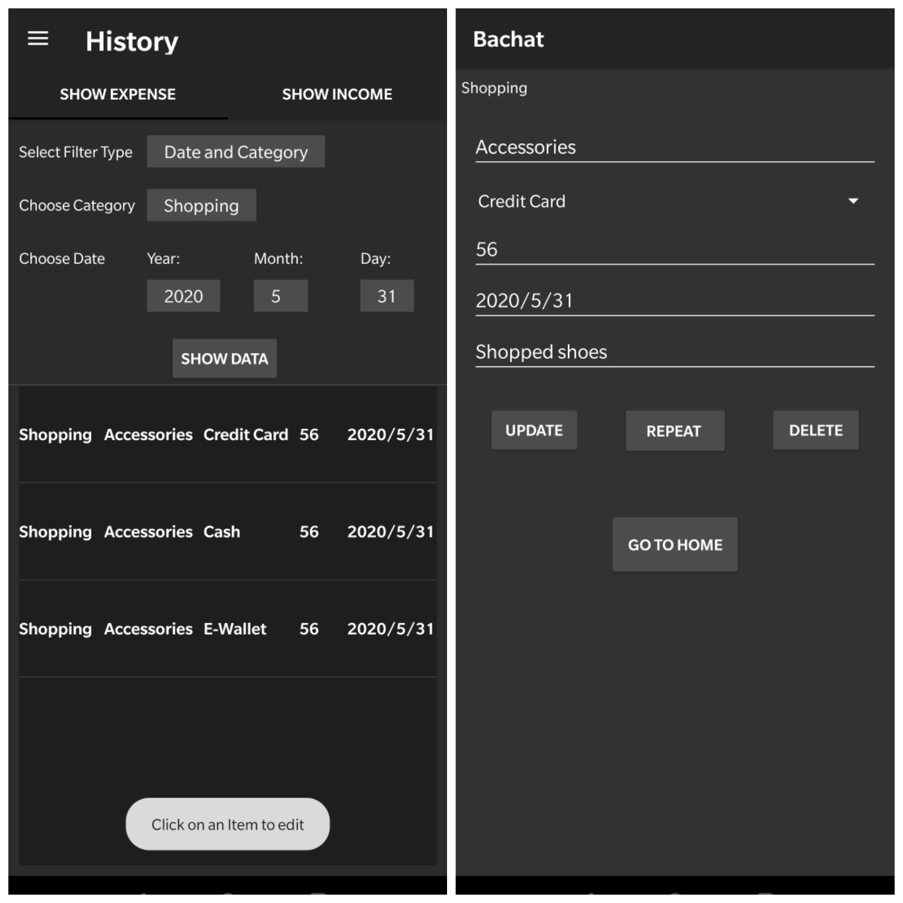

* **Once the user sees his list of transactions, he is given an option to edit his transactions by clicking on an item. Once he clicks, he can go ahead and change transaction details and update it, repeat it or delete it completely.**  

#### ***Threshold Setting***

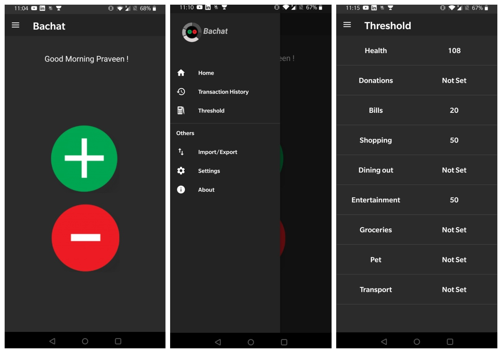

* **This fragment can be navigated from the drawer menu and allows the user to set thresholds on different categories so that the user can make informed decisions on the expenses.**   

#### ***Import***

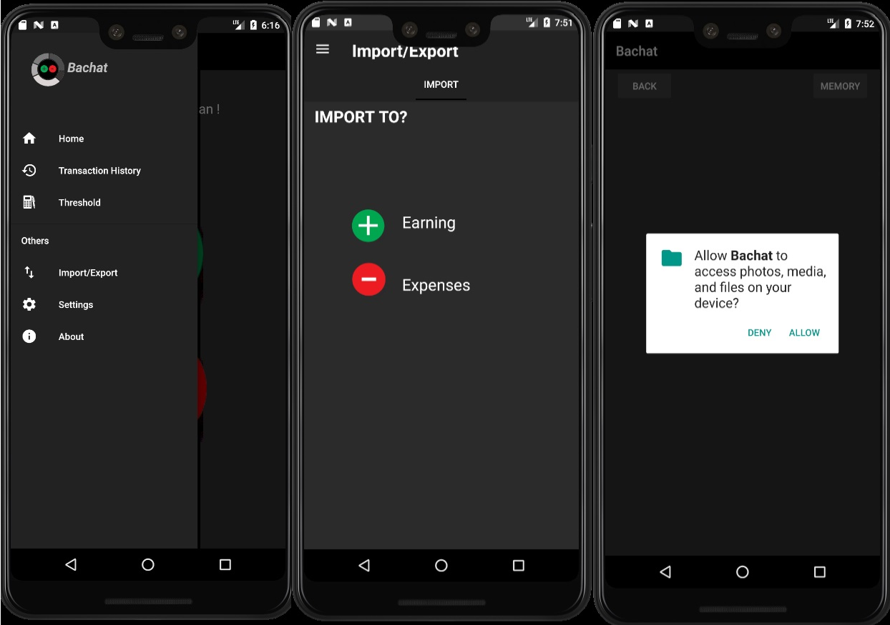

*  **As the name suggests, this fragment allows the user to import data from his phone's memory.**  

#                     

With that we come to the end of this blogpost. Hope you enjoyed reading and we believe you have atleast half figured what our app logo represents. If not, don't worry. Just stay tuned for the upcoming blogposts where we will be discussing Advanced and Beta prototypes. It is only going to get better from here. 

You can find the basic prototype apk here ->[Basic Prototype apk](https://code.ovgu.de/steup/gingerbread/-/blob/Basic_Prototype/apk/app-debug.apk).

Also, if you want to, here is a little demo for you ->[Basic Prototype Video](https://code.ovgu.de/steup/gingerbread/-/blob/Basic_Prototype/media/BasicPrototype.mp4).

**Unitil then, it's *good-bye* from Team Gingerbread.**

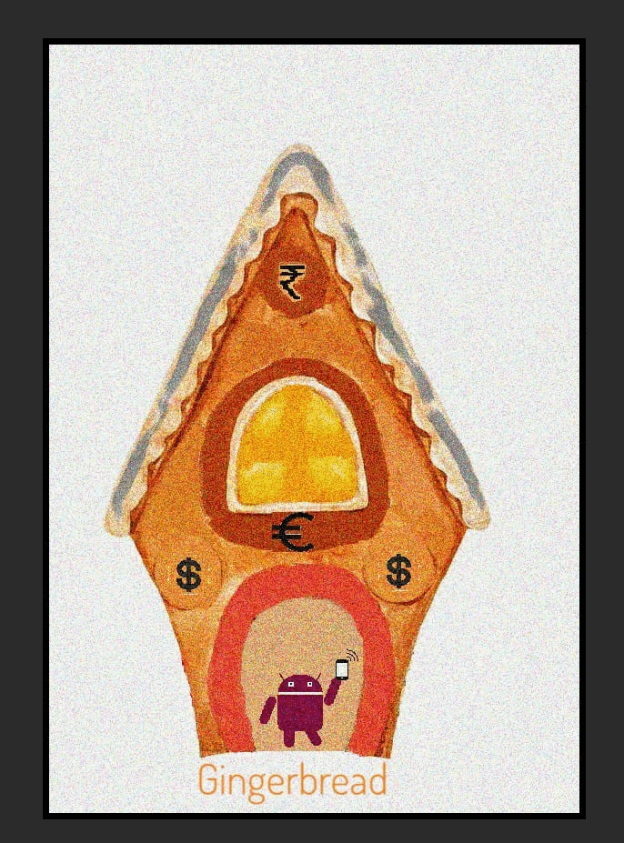 