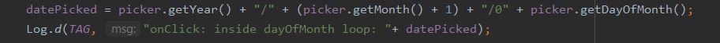
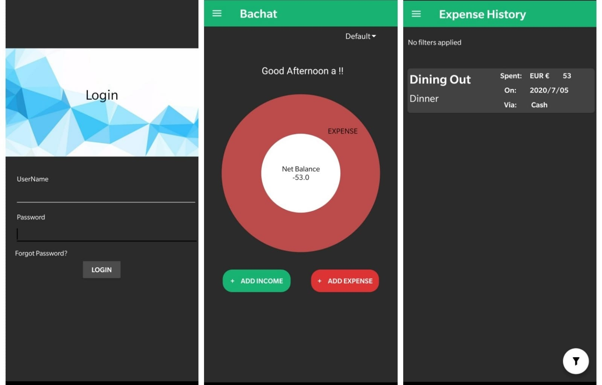
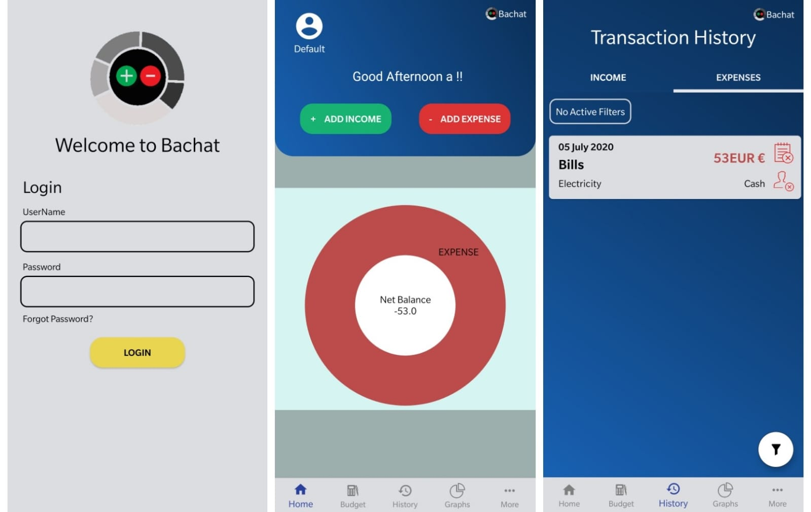
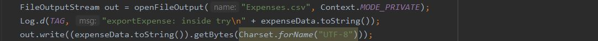
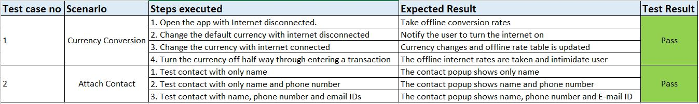
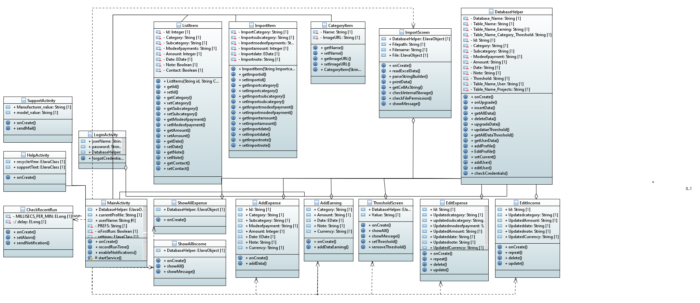
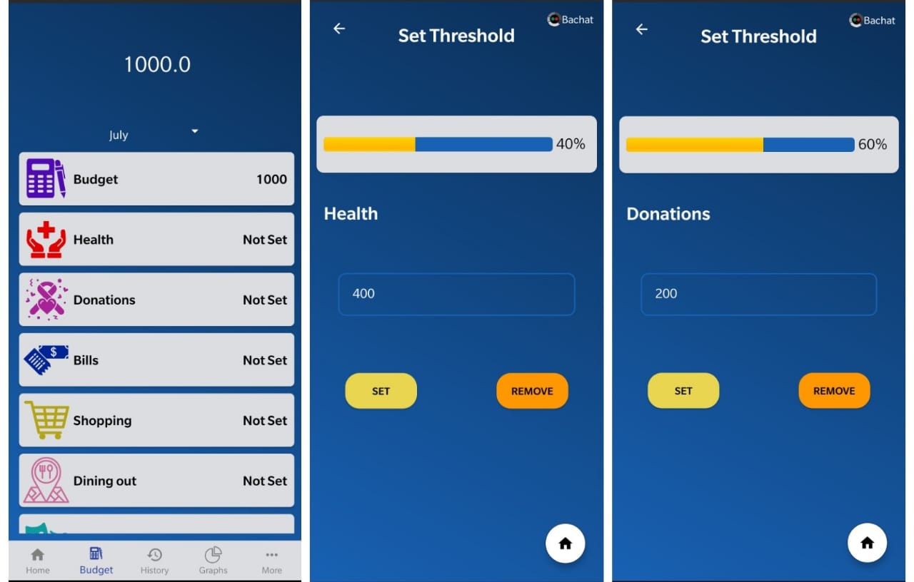
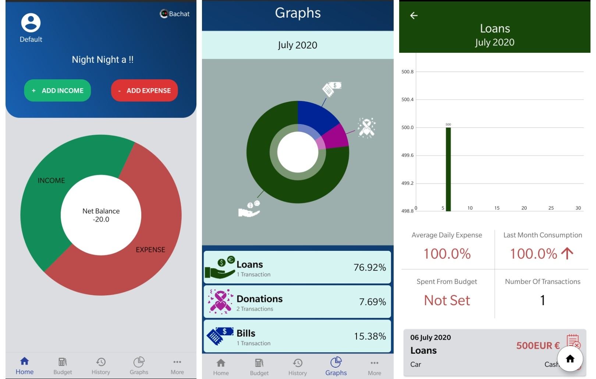
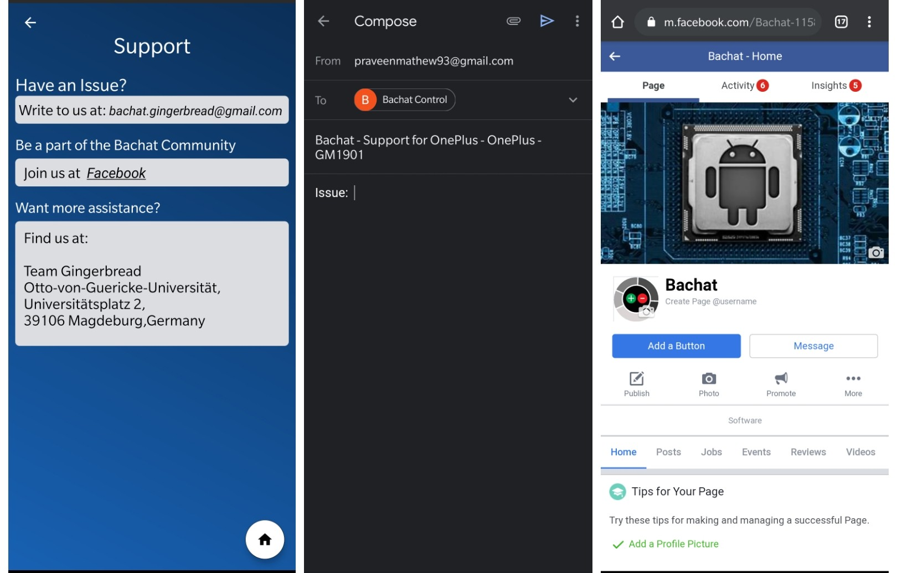

##### Hello there!! We meet again after two weeks of an extremely busy sprint. This time, the story is about **Bachat's** Beta Prototype!!

This is our penultimate blog post which means Bachat is almost ready to graduate and roll out into the market. 

In this blog post we will be highlighting perhaps one of the most important parts of Software Development -> **Software Testing!**

>  **“Software testing proves the existence of bugs not their absence.”**

Yes. It really does. In our case the statement above was so true that we had enough bugs to make a dedicated bug ecosystem. These bugs are not as friendly as this one here. They can be really painful when they attack. We were major victims of this virtual bug attack especially in our Advanced Prototype. Therefore, while on this journey, we learnt it the hard way that Software testing is a pivotal aspect in Software Development.

Our testing has mainly been manual Functional testing. They are mostly spread across many methods. On clustering them into two clusters, one can call them:
*  White Box Testing
*  Black Box Testing

##### White Box Testing

Most of our testing methods can be clubbed under White Box testing where the testers, which are the developers themselves do the testing with the knowledge of the internal code. The different sub-sections of White Box testing involve the following:

###### 1. Unit Testing:

Each developer tested and fixed all defects arising from their individual unit components. The user stories were divided amongst the developers with each developer taking charge of a set of user stories. These were considered as units and sub-units which were initially tested by the actual developers and later by other developers in the team.

**Errors and solutions**

*For example* : The user story of Login activity is a Unit which had sub-units of making the data reflect in another view where the user can edit the login credential details. Testing this entire Unit manually included testing both the areas and other subsequent areas that carried data from this setup page's information. 

The error from the example given above was that if the user exited the app by mistake without filling the page before the login activity, which is used to set the username and password, then when he opens the app again it would go to the login activity and he would not have any ID or password set. This is because the setup screen was made only for the first opening of the application.
 
We fixed this by keeping a dependency for the login activity on the setup screen 

###### 2. Integration Testing:

Each individual unit component was integrated with other unit components in the application and tested. This is an important test as individual units that work properly when Independent may not work when integrated with other units due to various issues. This type of testing primarily requires all developers to do primary testing to make sure integration is done efficiently.

**Errors and solutions**

*For example* : Filtering of transactions on date of entry. The format of date used for filtering was different from the format of date captured by the date picker when a transaction is entered.

We have generalized date formats throughout the application to avoid this miss (example: 2020/1/01 - 2020/12/31).

##### Black Box Testing

Towards the end of our prototypes, we shifted to Black Box testing methods where the testing is done without a view on the internal code. We sent our applications to our friends who have no knowledge of the code behind the app to see how easily they are being able to use each functionality and collected their inputs. This was not just the only form of Black Box testing that we did. To elaborate further, this can be divided into three sub-parts:

###### 1. Functional Testing: 

All the functional requirements provided by the user were tested under this with the help of our peers as mentioned above. We took inputs related to each function from different sources and worked on implementing or improving ideas and mistakes pointed out to us during the test.

*For example* : Setting a default Currency. Bachat has the default currency set to Euros until the user changes it in the user settings. The user will not be knowing this initially so if he makes a transaction as soon as he installs the app, the currency that he selects will be converted to the default currency Euro and shown to him in the graphs.

On suggestions, we added an option to set the Default currency in the initial setup page so that the user know which is the currency that he has chosen.

 ###### 2. System Testing: 

The application was tested in different environments/systems. This Black box testing method was to ensure the reliability of Bachat in different devices. 

The result of this test was mainly related to the User Interface. The layouts had issues adjusting into the screens of some phones while they fitted perfectly in others. The UI developers were the ones who were mostly affected by this testing.

We also came across non-UI issues as a result of system testing:

*   Our import feature was working fine inside our emulator (API 24) which has a SD card support. When we tested this in phones with only internal storage, the import was not getting completed. We worked further on this and fixed the issue. Now our import feature is perfected thanks to system testing. 

*   Another non-UI impact we had due to System testing was the passing of intent from an extended adapter to a View pager while implementing the Help menu functionality. This again, was working fine in our virtual emulators with but crashed when we tried in our high end mobile devices (Strange right? I know!). We had to revamp our entire approach to make the view pager open on a simple button click. Two ambitious attempts by team Gingerbread shot down by the villainous System Testing method!.  

###### 3. Acceptance Testing: 

The App was shown to our client in our weekly meetings in this Black box testing method. No matter what we do the client's acceptance is of very high priority. We took all the time given to us to interact with our client (Even an extra hour in one occasion!). We took in his inputs and implemented them as we developed other functionalities.

The main changes were related to our User Interface as shown below:

The one on the left used to be how Bachat used to look like when he was in a younger state of Advanced Prototype. The one on the right is how Bachat looks now after implementations from the Acceptance testing results. We have paid more attention to detail in the latest look with more colours and matte finishes.

##### Usage of tests

We have followed manual testing throughout our development. Due to the agile environment and the short time frame, we were not able to create test cases to automatically reject or accept changes while pushing the code.

To avoid too many issues, we logged our code at many places so that when new additions were made, we could properly track the flow of control of the code.

##### Test tracking and results.

A few of the tests mentioned above were documented using google docs and shared amongst our team to update the errors, the expected output and the final results. Given below is a snippet of our manual test tracker. We could not do automated testing as well as the time constraints kept staring at us from all angles. Given below is a snippet of our test case tracker and it's results at the end of the sprint.

#### New Requirements:

There were a couple of changes in requirements ready for us after our Advanced prototype went live. One of them was the promotion the requirement of the Help menu from a "Nice to have" to a "Necessary feature". Another candidate who got a promoted was the Export feature which jumped two levels from "Nice to have" to "Essential". 

But there was a new joiner in the list and that is given below: 

*  **As a user, I would like to have a section in the app that can help me reach the developers (Yes, that is us).**

This additional "Nice to have" requirement was the only surprise from our client although we were planning on doing this as we care a lot about Bachat's users.

We were half-way through "Nice to have" requirements like Graphs/Charts, Import option, Notifications and a simple recommendation feature. We have completed these as well as the new addition in our Beta Prototype. 

Finally, as we release our Beta Prototype, we are happy to say that we could accommodate all the requirements that were given to us. The list of all User stories(including the promoted ones)  are given below: 

#### User Stories: Given below is the complete list of all user stories that we have received (and completed).

##### Essential:

1. **As a user, I would like to be able to enter my expenses and group them into categories.**
1. **As a user, I would like to add a date and timestamp on every expense I enter.**
1. **As a user, I would like to select expenses based on filters like category, date, month and year.**
1. **As a user, I would like to have a feature of adding notes, bullet points and other details for every expense I add.**
1. **As a user, I would like to have an option to choose the method of payment.**
1. **As a user, I would like to have a repeat expense option for me to repeat an expense from the list of expenditures.**
1. **As a user, I would like to be able to add transactions in multiple currencies and also set a default currency.**
1. **As a user, I would like the app to export my details of entries.**

##### Necessary:

1. **As a user, I would like to have icons assigned to each category.**
1. **As a user, I would like to have an option of updating and/or deleting my transaction entries when required.**
1. **As a user, I would like to see the list of repeated transactions to choose from when I am entering a new transaction.**
1. **As a user, I would like to have a feature for overall budget planning and also be able to set category level thresholds.**
1. **As a user, I would like to have a dedicated tab to enter incomes from all different sources.**
1. **As a user, I would like to have a login screen, to prevent un-authorised access to my transactions by others who might use my device.**
1. **As a user, I would like to have a start screen at the first install of the app which can explain what the app is about and what are the main features.**
1. **As a user, I would like to have a section in the app that can help me reach the developers**
1. **As a user, I would like to attach contacts to my transactions, and get detail of their name, numbers(all) and E-mail ids (all) from my contact list.**

##### Nice to have:

1. **As a user, I would like to see my expenses in the form of graphs or charts, to get a percentage overview.**
1. **As a user, I would like to have a help section that gives me an overview of how to use the application.**
1. **As a user, I would like to have insights about my spending, including the categories in which I have spent the most on a weekly/monthly basis.**
1. **As a user, I would like the app to import my weekly/monthly/yearly details of entries.**
1. **As a user, I would like to select the currency when I enter the transactions and convert it to a default currency that I have set.**
1. **As a user, I would like to create several projects within the same app, so that I can manage my transactions from different domains (say official and domestic) easily.**
1. **As a user, I would like to have the app guide me by providing a few recommendations, based on my activities to increase ease of use and manage my budget smartly.**
1. **As a user, I would like to receive notifications, informing me about aspects related to my budget activities.**

That counts up to a total of 25 user requirements that we have managed to implement in our application.

#### Class Diagram:

We have now reached that part of the blog where we sit and study the class diagram!

The new additions are the *Help Menu* and the *Support Screen* which are depicted above (far left) by their respective classes. 

#### Testing:

The new changes were not as overwhelming as those that came after the Basic Prototype. Therefore we dedicated over 4 days of complete Black box testing with daily APK generations and modifications. The Help menu, which required screenshots from within the app, kept getting updated with changes in the UI as a part of the test results related fixes. 

## Working Prototype 

Coming to a few glimpses of the working prototype, given below are screenshots highlighting three features of the app:

**1) Setting Budget(Threshold) and tracking.**

The overall budget value can be set initially and then separate thresholds can be set for different categories. The percentage bar would indicate how the budget setting is kept under check.

**2) Graphical representations.**

The main page has a graph that shows the difference between the user's Income and Expense entries. If you click the graphs button in the bottom navigation, a new pie chart opens showing better details on the user's expenses. If the user clicks the categories shown in the graph, he will be shown even further details about it looking at which the user can get more insights about his expenditure. 

**3) Support from the developers.**

From the more options in the bottom navigation bar, the user can select the Support option where he can see the E-mail adress to reach us developers. On clicking this E-mail ID, he will be taken to his email app where he can write down the issue he is facing with the app. This E-mail will be having the details of the user's phone with it so that us developers know what phone is being used by our user so that we can use that input to fix issues.
There is also an option to join the Bachat community in Facebook. All the user needs to do is click on the *Facebook* text and he will be re-directed to Bachat's facebook page.
The support page also has the address of our team in case the user needs more assistance regarding any issue related to the app.

Now that you have got a glimpse of Bachat's Beta prototype, go ahead and have a look at the app itself.

*You can find the Beta prototype apk here ->* [Beta Prototype apk](https://code.ovgu.de/steup/gingerbread/-/blob/Beta_Prototype/Beta%20Prototype/apk/Bachat.apk).

