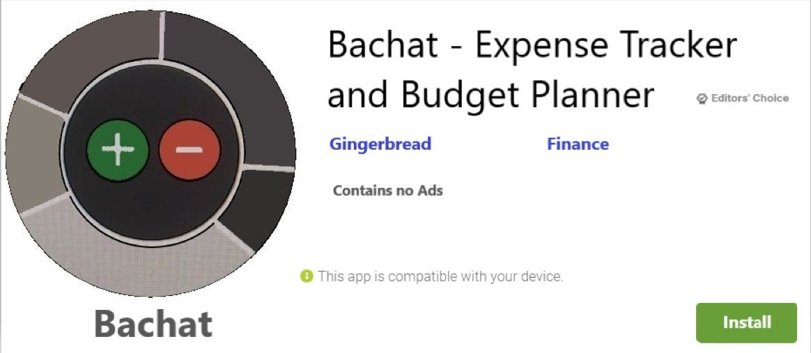
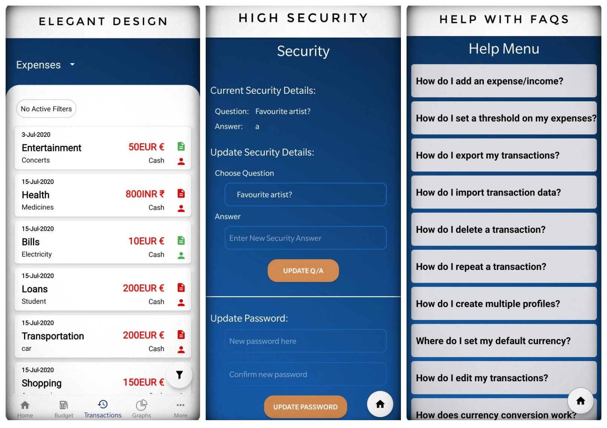
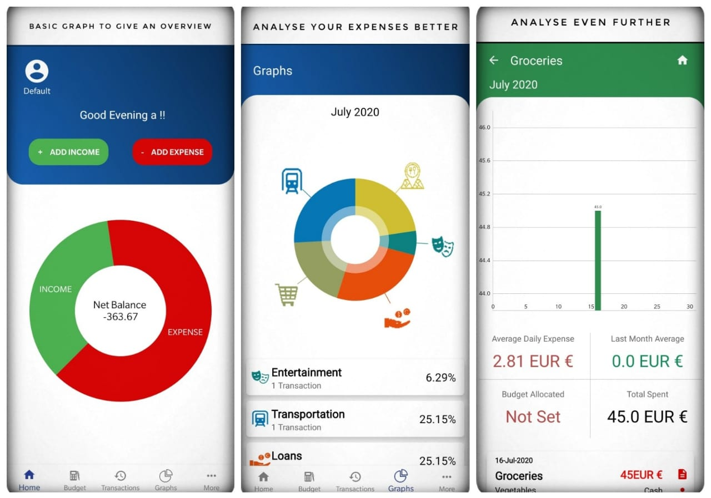
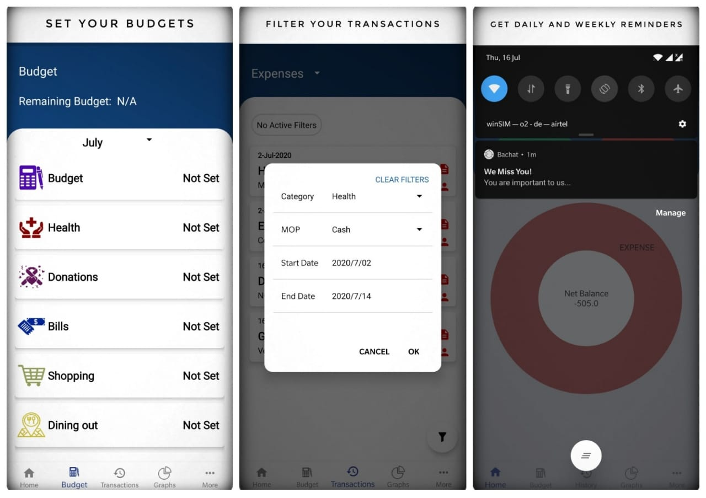
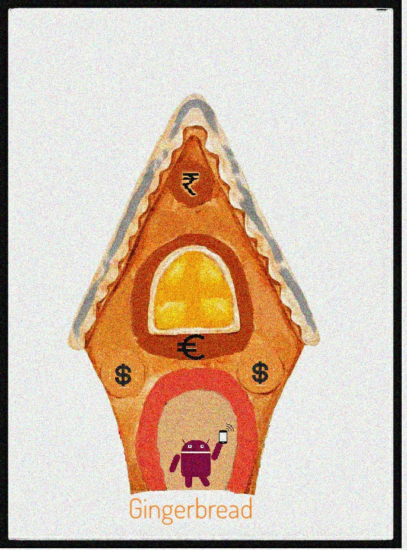

###### Welcome to the final blog post of Bachat's journey! This post is all about Bachat's graduation. Yes, Bachat is moving into Google Play Store. Without further delay let's dive straight into the Play Store then, shall we?

[Install](https://code.ovgu.de/steup/gingerbread/-/blob/Final_App/Final_App/apk/Bachat.apk)

Saving for your dream car, a new phone perhaps or maybe that amazing get away you have been waiting for? We have all been there; setting saving goals to meet our targets and then spending all the money as soon as the salary hits our accounts haven't we! But with Bachat, now you can actually take your first steps towards meeting your targets. With the ability to set multiple saving goals, whether it is to stop spending your cash on all that junk food or perhaps to curtail your shopping expenses! Set a monthly budget to keep your expenses under check and with the added functionality of setting specific category budgets you will never have to worry about overshooting your limits. For once, the sky is not the limit ;)

Finding it difficult to manage your personal and business related finances? Handle them separately with no hassles. Moving around the World with different currencies? don't worry about those ever-changing conversion rates, Bachat has got you covered.

With Bachat as your expense manager, you can rest assure to get a hold of your spendings as the app helps you “save more and live better”. 

### Description

"When it hasn't been your day, your week, your month or even your year, but I'll be there for you". 
We know we could have been more original with this, but well, when it comes to being a true friend you can count on Bachat... Quite literally :p
Bachat will help you figure out how much you spend on shopping, groceries, entertainment and much more. Bachat is that friend who is there for you... Whenever, wherever and however! 

#### How does Bachat work?
"You can count on me like 1,2,3; I'll be there"... See a pattern developing here? Well so are we! Bachat is as familiar as these lyrics are to you and is just as catchy! 

Bachat works in a very simple way. The application allows you to log your expenses and incomes under different categories. You can choose or create sub-categories to further refine your entries. Once you have added transactions, you can set budgets for certain categories or even an overall monthly budget. Bachat will now help you monitor your budget throughout the month and have a firm grip on all your expenditures.

##### Why does Bachat need permissions:

We at Gingerbread believe in complete transparency with our users. We would not like any shady business as users ourselves and to give our client base the peace of mind that their personal data is always safe and never used against their will, we are going to give you a breakdown of where and exactly why we need to access certain things. 

###### 1) Bachat needs your permission to add a contact to a transaction (in case you have borrowed or lent money or have shared a transaction):

This is an optional feature and you can always opt to not provide the permission.

###### 2) Bachat needs your permission access your internal storage to import files into the app:

This is required if you are planning on importing your transaction details from a folder inside your phone's storage.

Again as with the above mentioned permission, this is an optional feature and you can always opt to not provide the permission if you do not wish for us to import your files.
 

##### Why would you use Bachat?

If you are anything like us at Gingerbread, then you will fall in love with Bachat. From being a question of why, you will soon be thinking why wasn't I using this app earlier! 

You can never have enough savings and we being students ourselves understand the challenges that come with managing money and trying to cut out on those avoidable and sometimes unnecessary expenses. With Bachat by your side you can easily track all your incomes and expenses and reduce your budget related worries. 

You can save your hard earned money because Bachat is a practical budget planner that helps you stay on top of your funds and finances and helps you meet your goals. 

### How to get started? 

*  Download Bachat app for free from the Install link above or use this alternative link if that does not work: [Install](https://drive.google.com/file/d/1PbO0r4F6jOMgoSa2Wj4g-GJB99QLWmiZ/view?usp=drivesdk)
*  Install the application.
*  Sign up with a username and set a password.
*  Provide your E-mail address.
*  Create Accounts, if you like. 
*  Add transactions.
*  Set Bugets. 
*  Relax and let Bachat take care of the rest. 

You can always refer the Help menu for more guidance and if you need further help still, feel free to get in touch with us through our various support channels. Our gates are always open! 

##### How to manage Accounts?

The app comes with a default account. You can set up any number of accounts depending on your needs. The transactions and the Budgets for each account can be viewed separately.

##### How to manage a Budget?

After clicking the budget icon on the home screen, you can access the budget manager where you can set your overall budget and also set limits based on each category as a percentage of your overall budget. 

##### How to view Reports? 

Click on History from the Home Screen. View all of your Expense and Income reports with different filters. Save the report in Csv and send to your email address. Check your expense reports via different graphic charts.

##### How to see a visual depiction of your transactions?

You can view the main visual graph on home screen as soon as you make an entry. This graph will show you an overview of your incomes and expenses. To view more descriptive and interactive graphs, press on the graphs icon from the bottom navigation bar. Then, click on a category to get more insights including average daily expenditure and amount of allocated budget still remaining. 

### Key features:

* Add expenses and incomes. 
* Choose different categories with icons.
* Choose from different modes of payments.
* Operate using multiple accounts.
* Record transactions with multiple currencies.
* Visual graphs and statistics.
* Add custom notes and attach contacts to the entries.
* Password protection with security questions.
* Delete, edit and repeat transactions.
* Set budget based on categories.
* Add sub-categories for expenses to refine the transaction.
* Export transactions in CSV format. 
* Import transactions from XLS files.
* Reliable support with social media community.

### Additional App Information:

*  **Category:** Finance
*  **Price:** FREE
*  **Size:** 14.3 MB
*  **Version:** 1.0
*  **Updated:** 15th July 2020
*  **Requirement:** Android 7.0 and above

### How to reach Us?

Join our [FACEBOOK](https://www.facebook.com/Bachat-115881850181842) community. 

**Developed by Team GingerBread**

  

###### Hope you had a great time reading about our Journey. Do make Bachat a part of your life. It is time now to say good-bye.
##### This is Team Gingerbread signing off!
